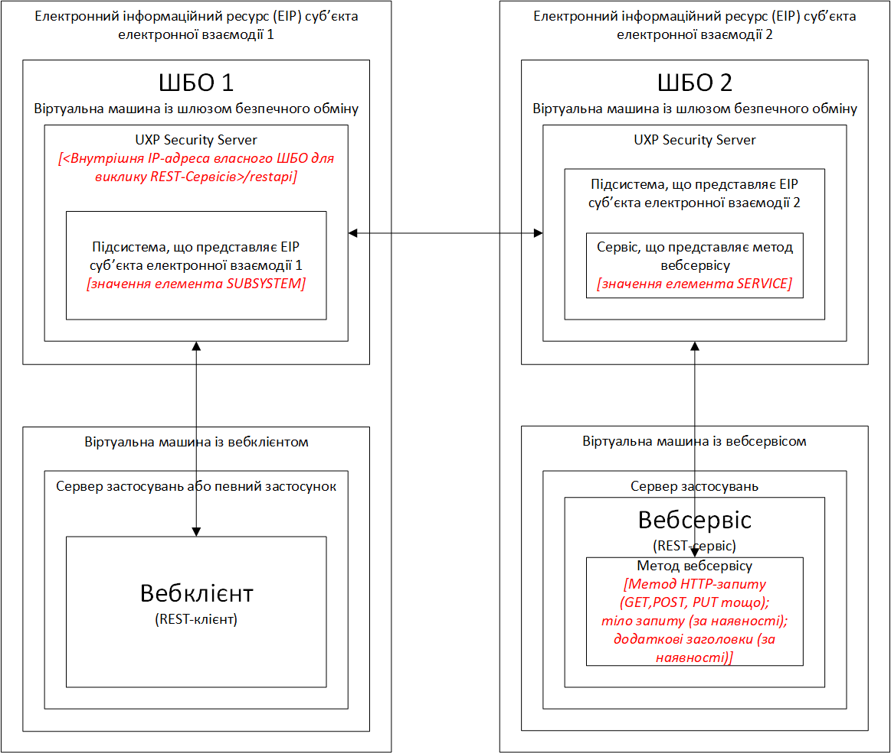
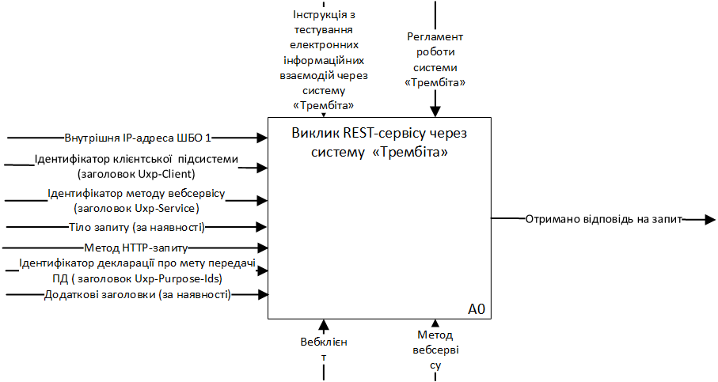

#  Робота із REST-сервісами в системі «Трембіта»
## Перелік термінів та умовних скорочень

| Термін  | Пояснення |
| :-------------: | :-------------: |
| Система електронної взаємодії державних електронних інформаційних ресурсів (система «Трембіта», система)  | Інформаційно-комунікаційна система, призначена для автоматизації та технологічного забезпечення обміну даними між Суб’єктами електронної взаємодії з електронних інформаційних ресурсів під час надання адміністративних послуг та здійснення інших повноважень відповідно до покладених на них завдань  |
| Підсистема моніторингу доступу до персональних даних (ПМДПД) | Складова частина системи «Трембіта», призначена для збереження відомостей про факти передачі суб’єктами електронної взаємодії персональних даних, їх накопичення та забезпечення інформування суб’єктів персональних даних про факти такої передачі  |
| Шлюз безпечного обміну (ШБО) | Сервер, на який встановлено програмне забезпечення UXP Security Server  |
| Unified eXchange Platform (UXP) | Програмна платформа, на базі якої побудована система «Трембіта»  |

## Вступ
Система «Трембіта» є одним із ключових елементів інфраструктури надання електронних послуг громадянам та бізнесу, який забезпечує зручний уніфікований доступ до даних електронних інформаційних ресурсів. 
Створення взаємодій між електронними інформаційними ресурсами завдяки системі «Трембіта» – процес не складний, оскільки:
-	при їх побудові використовується єдиний набір правил та форматів;
-	обмін даними в системі здійснюється через шлюзи безпечного обміну та опубліковані на них сервіси та підсистеми, які представлять електронні інформаційні ресурси.

Такий підхід не передбачає централізації даних електронних інформаційних ресурсів і зміни їх власника, а одержання доступу до даних різними установами здійснюється відповідно до попередньо заданих на ШБО повноважень, що, у свою чергу, підвищує якість надання електронних публічних послуг громадянам та бізнесу.

Також системою забезпечується високий рівень захищеності завдяки підписанню електронною печаткою та шифруванню всіх даних, що передаються, а також протоколюванню подій, контролю доступу до сервісів.
Нижче ви знайдете відомості стосовно розробки REST-сервісів, сумісних з системою «Трембіта».

## Вимоги до розробки REST-сервісів, сумісних з системою «Трембіта»
Система «Трембіта» підтримує роботу з REST-сервісами, які розроблені будь-якою мовою програмування та реалізють необхідну для Вашої організації бізнес-логіку. 

Наполегливо рекомендуємо уникати розробки вебсервісів, що передбачають обмін даними у форматі, що не дозволяє здійснити автоматичний аналіз даних засобами локального компоненту ПМДПД (наприклад, base64, файл вкладення).

### Вимоги до полів сервісів 
Кожний опублікований сервіс повинен містити зрозумілу назву для кожного вхідного та вихідного поля. 
#### Порядок задання кодів сервісів для REST-сервісів 
1. Код сервісу для REST-сервісу встановлюється при його [публікації на ШБО певного Учасника системи «Трембіта»](#публікація-rest-сервісів-в-системі-трембіта).
2. Код запитуваного сервісу вказується у REST-клієнті у HTTP-заголовку UXP-Service у форматі рядка, структура якого наведена у розділі ["Заголовки запитів для REST-сервісів, необхідні задля забезпечення сумісності з системою «Трембіта»"](#заголовки-запитів-для-rest-сервісів-необхідні-задля-забезпечення-сумісності-з-системою-трембіта).

За бажанням - розробники можуть додати до сервісів заголовки, які передаються між ШБО для реалізації додаткового логування.

Також рекомендовано при розробці REST-сервісів використовувати [EU interoperability core vocabulary](https://ec.europa.eu/isa2/sites/default/files/e-government_core_vocabularies_handbook.pdf).

## Публікація REST-сервісів в системі «Трембіта»
Публікація REST-сервісів в системі «Трембіта» здійснюється відповідно до настанов [Інструкції користувача шлюзу безпечного обміну з роллю «Адміністратор вебсервісів»](https://portal.trembita.gov.ua/media/website-media/Instruktsiya_Administratora_vebservisiv.pdf). 

### Вимоги до іменування сервісів на ШБО
1. Код сервісу повинен бути представленим наступним чином: 
```ServiceName_ServiceVersion```
де: 
- ServiceName – назва сервісу;
- ServiceVersion – версія сервісу (наприклад, v1). 

2. Код сервісу має бути унікальним в межах однієї підсистеми, через яку публікується сервіс.

3. Назва сервісу повинна складатись із словосполучення англійською мовою, яке відповідає певному зрозумілому поняттю. 

Наприклад, ```GetPersonFullNameByDRFOCode.```

4. Всі слова в назві сервісу повинні писатись без скорочень.
   
5. Загальноприйняті абревіатури українськими літерами в назвах сервісів повинні писатись латиницею з використанням правил транслітерації.  

6. Послідовність слів у назві сервісу повинна відповідати правилам англійської мови.
   
7. Назва сервісу повинна бути створена відповідно до стилю написання складених слів UpperCamelCase.
   
8. Коду сервісу має бути призначена нова версія сервісу, якщо змінюються найменування вхідних / вихідних полів або їх опис, але не змінюється перелік вхідних та вихідних відомостей запиту та відповіді відповідно. 

Після того, як REST-сервіс було опубліковано, на ШБО з'являється сутність **SERVICE** - ідентифікатр даного REST-сервісу (методу вебсервісу), який в подальшому знадобиться для його виклику.



## Особливості виклику REST-сервісів з використанням системи «Трембіта»
В системі «Трембіта» електронні повідомлення-запити надсилаються наступним чином:
-	від вебклієнта до ШБО, який знаходиться в одній інформаційно-комунікаційній системі із вебклієнтом (далі - **ШБО 1**);
-	далі від **ШБО 1** до ШБО, на якому опубліковано сервіс, що представляє певний опублікований метод вебсервісу (далі - **ШБО 2**);
-	далі від **ШБО 2**, до самого методу вебсервісу.

Процес проходження електронного повідомлення-відповіді від методу вебсервісу до вебклієнту є ідентичним й відбувається у зворотному напрямку через ШБО:


На рисунку нижче в нотації IDEF0 відображено процес виклику REST-сервісу через систему «Трембіта», зокрема, з усіма необхідними вхідними відомостями, які для цього потрібні, а саме:
- значенням Endpoint для виклику сервісу (```http[s]://<security-server>/restapi[?<request-parameters>]```, технічні деталі описано в розділі [«URL-формат запиту для REST-сервісів»](#URL-формат-запиту-для-REST-сервісів));
-	методом HTTP-запиту (відповідно до документації на певний вебсервіс);
-	тілом запиту (відповідно до документації на певний вебсервіс);
-	значенням ідентифікатора декларації про мету передачі персональних даних (Uxp-Purpose-Ids, який можна отримати, надіславши засобами Каталогу системи «Трембіта» запит для формування унікального ідентифікатору декларації про мету передачі персональних даних до володільця сервісу) - **застосовується лише у випадку роботи сервісу через Підсистему моніторингу доступу до персональних даних системи «Трембіта»**;
-	додатковими заголовками (за наявності, відповідно до документації на певний вебсервіс).




## Заголовки запитів для REST-сервісів, необхідні задля забезпечення сумісності з системою «Трембіта»
| Заголовок  | Значення | 
| :-------------: | :-------------: |
| Uxp-Client | ```<instance>/<member-class>/<member-code>/<subsystem-code> ```|  
| Uxp-Service | ```<instance>/<member-class>/<member-code>/<subsystem-code>/<service-code>/<service-version>``` | 
| Uxp-QueryID | ідентифікатор повідомлень в інформаційній системі клієнта |
| Uxp-Purpose-Ids  | **(обов’язково при використанні ПМДПД)** – ідентифікатор декларації про мету передачі персональних даних, який можна отримати, надіславши засобами Каталогу системи «Трембіта» запит для формування унікального ідентифікатору декларації про мету передачі персональних даних до володільця сервісу |  
| Uxp-Subject-Id | (обов’язково, якщо при використанні ПМДПД ідентифікатор суб’єкта персональних даних передається в заголовку, а не в тілі повідомлення) – ідентифікатор суб’єкта персональних даних |  

де:
- ```<instance>``` - середовище системи «Трембіта», SEVDEIR-TEST – для тестового та SEVDEIR – для промислового середовища;
- ```<member-class>``` - значення за замовченням – GOV
- ```<member-code>``` - код ЄДРПОУ Суб’єкта електронної взаємодії, що є власником сервісу (для заголовку Uxp-Service) або Суб’єкта електронної взаємодії, що запитує інформацію від сервісу (для заголовку Uxp-Client);
- ```<subsystem-code>``` - код підсистеми, на якій опубліковано метод вебсервісу (для заголовку Uxp-Service) або підсистеми, що представляє клієнт сервісу (для заголовку Uxp-Client) в системі «Трембіта»;
- ```<service-code>``` - код методу вебсервісу, опублікованого в системі «Трембіта» (код сервісу);
- ```<service-version>``` - версія сервісу, не обов’язковий для заповнення атрибут.

Запити також можуть мати додаткові заголовки, які визначені окремо в документації на певний вебсервіс.

Приклад заповнення значень стандартних заголовків для REST-сервісу наведено нижче:
```
Uxp-Client: SEVDEIR-TEST/GOV/00000001/SUB_1
Uxp-Service: SEVDEIR-TEST/GOV/00000002/SUB_2/space/1
Uxp-QueryID: 7ef7045f-d886-4b32-8142-a40958a3ae8e
Uxp-Purpose-Ids: 9K9J65I75ILCLMPDUIRXS
Uxp-Subject-Id: 1234567036
```

## URL-формат запиту для REST-сервісів
URL-формат запиту для REST-сервісів складається з:

```
<METHOD> http[s]://<security-server>/restapi[?<request-parameters>]
```
де 
```<METHOD>``` – це HTTP-метод. ШБО підтримуються наступні HTTP-методи: HEAD, GET, DELETE, POST, PUT і PATCH. Інформація про те, які HTTP-методи підтримуються певним сервісом, повинна бути надана в документації на нього;

```<security-server>``` – IP-адреса ШБО 1;

```[?<request-parameters>]``` – можливі параметри запиту, інформація стосовно яких повинна також бути надана в документації на певний вебсервіс.


Нижче наведено приклад URL-адреси для запиту до REST-сервісу. Поля для заповнення параметрів запиту були заповнені фактичними значеннями - 15 і 9:
```
GET http://203.0.113.6/restapi?x=15&y=9
```

##
Матеріали створено за підтримки проєкту міжнародної технічної допомоги «Підтримка ЄС цифрової трансформації України (DT4UA)».
