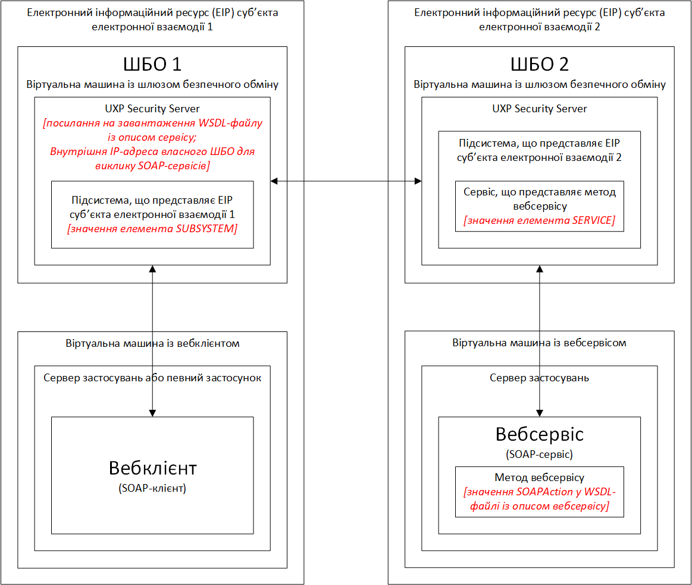
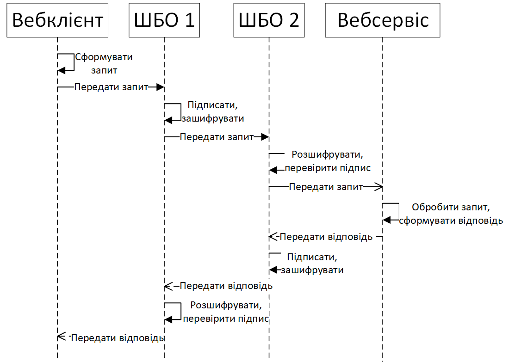
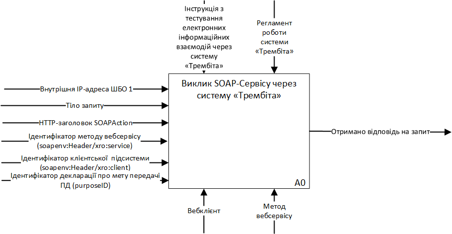

#  Робота із SOAP-сервісами в системі «Трембіта»
## Перелік термінів та умовних скорочень
| Термін  | Пояснення |
| :-------------: | :-------------: |
| Система електронної взаємодії державних електронних інформаційних ресурсів (система «Трембіта», система)  | Інформаційно-комунікаційна система, призначена для автоматизації та технологічного забезпечення обміну даними між Суб’єктами електронної взаємодії з електронних інформаційних ресурсів під час надання адміністративних послуг та здійснення інших повноважень відповідно до покладених на них завдань  |
| Підсистема моніторингу доступу до персональних даних (ПМДПД) | Складова частина системи «Трембіта», призначена для збереження відомостей про факти передачі суб’єктами електронної взаємодії персональних даних, їх накопичення та забезпечення інформування суб’єктів персональних даних про факти такої передачі  |
| Шлюз безпечного обміну (ШБО) | Сервер, на який встановлено програмне забезпечення UXP Security Server  |
| Unified eXchange Platform (UXP) | Програмна платформа, на базі якої побудована система «Трембіта»  |

## Вступ
Система «Трембіта» є одним із ключових елементів інфраструктури надання електронних послуг громадянам та бізнесу, який забезпечує зручний уніфікований доступ до даних електронних інформаційних ресурсів. 
Створення взаємодій між електронними інформаційними ресурсами завдяки системі «Трембіта» – процес не складний, оскільки:
-	при їх побудові використовується єдиний набір правил та форматів;
-	обмін даними в системі здійснюється через шлюзи безпечного обміну та опубліковані на них сервіси та підсистеми, які представлять електронні інформаційні ресурси.

Такий підхід не передбачає централізації даних електронних інформаційних ресурсів і зміни їх власника, а одержання доступу до даних різними установами здійснюється відповідно до попередньо заданих на ШБО повноважень, що, у свою чергу, підвищує якість надання електронних публічних послуг громадянам та бізнесу.

Також системою забезпечується високий рівень захищеності завдяки підписанню електронною печаткою та шифруванню всіх даних, що передаються, а також протоколюванню подій, контролю доступу до сервісів.
Нижче ви знайдете відомості стосовно розробки SOAP-сервісів, сумісних з системою «Трембіта».

## Вимоги до розробки SOAP-сервісів, сумісних з системою «Трембіта»
Система «Трембіта» підтримує роботу з SOAP-сервісами (версії 1.1 та **1.2**), які розроблені будь-якою мовою програмування та реалізють необхідну для Вашої організації бізнес-логіку. 

Структура електронних повідомлень, якими здійснюється обмін між ШБО, має відповідати форматам електронних повідомлень та обміну даними, затверджених наказом Державного агентства з питань електронного урядування України від 13.08.2018 р. № 51 «Про затвердження форматів електронних повідомлень та обміну даними системи електронної взаємодії державних електронних інформаційних ресурсів», зареєстрованого в Міністерстві юстиції України 21 вересня 2018 р. за № 1087/32539. 

Наполегливо рекомендуємо уникати розробки вебсервісів, що передбачають обмін даними у форматі, що не дозволяє здійснити автоматичний аналіз даних засобами локального компоненту ПМДПД (наприклад, base64, файл вкладення).

### Вимоги до полів сервісів 
Кожний опублікований сервіс повинен містити зрозумілу назву для кожного вхідного та вихідного поля. 
#### Порядок задання кодів сервісів для SOAP-сервісів 
1. Код сервісу для SOAP-сервісу задається на рівні методів (операцій) шляхом визначення значення XML-атрибуту "name" XML-елементу WSDL-опису ```<wsdl:operation>```, де ```xmlns:wsdl="http://schemas.xmlsoap.org/wsdl/"```. 
2. Код сервісу вказується SOAP-клієнтом при запиті у відповідному полі заголовків електронного повідомлення-запиту - XML-елементі ```<id:serviceCode>```, де ```xmlns:id="http://x-road.eu/xsd/identifiers"```.

### Вимоги до назв просторів імен SOAP-сервісів 
1. Цільовий простір імен (target namespace) SOAP-сервісу, який публікується у системі «Трембіта», повинен бути глобально унікальним в межах кіберпростору та прив’язаний до Суб’єкта електронної взаємодії або Оператора.
   
2. Цільовий простір імен повинен бути представлений URI, який відображає зареєстроване доменне ім'я Суб’єкта електронної взаємодії або Оператора та може містити додаткові елементи.

Наприклад: ```"http://organization01.gov.ua/trembita/api/GetPersonFullName"```.

3. Всі вхідні та вихідні параметри, унікальні для електронних інформаційних ресурсів, що є джерелом інформації для SOAP-сервісу, можуть мати найменування у форматі XML, розміщені у цільовому просторі імен.
   
   URI, яким представлений цільовий простір імен, повинен бути:
   - представлений валідною HTTP адресою-посиланням на XML-схему опису типів даних вхідних та вихідних параметрів;
   - бути доступним завжди і всім користувачам мережі Інтернет без авторизації до моменту виведення з експлуатації всіх електронних інформаційних взаємодій (тобто всіх SOAP-клієнтів, які використовують відповідні SOAP-сервіси з наведеними вхідними та вихідними параметрами).
   
5. У випадку, якщо SOAP-сервіси призначені для обміну невеликим об’ємом інформації, дозволяється не виділяти окреме посилання на XML-схему, якщо вона вбудована у файл WSDL-опису SOAP-сервісу. 

Обов'язкові простори імен наведено в таблиці нижче:

| Префікс  | Простір імен |
| :-------------: | :-------------: |
| soapenv | http://schemas.xmlsoap.org/soap/envelope/ | 
| xro | http://x-road.eu/xsd/xroad.xsd |
| iden | http://x-road.eu/xsd/identifiers |
| custom_prefix | Ідентифікатор простору імен структур даних, які містять інформацію-запит та/або інформацію-відповідь, створюється постачальником вебсервісу. За потреби включення додаткових XML-схем для опису структури даних запиту та відповіді вони мають бути включені до файлу WSDL-опису вебсервісу, а також бути доступними за URL, що є одночасно простором імен |


За бажанням можна додати для розроблюваних вебсервісів [заголовки](#заголовки-запитів-для-soap-сервісів-необхідні-задля-забезпечення-сумісності-з-системою-трембіта), які передаються між ШБО для реалізації додаткового логування.

Також рекомендовано при розробці  SOAP-сервісів використовувати [EU interoperability core vocabulary](https://ec.europa.eu/isa2/sites/default/files/e-government_core_vocabularies_handbook.pdf).

## Публікація SOAP-сервісів в системі «Трембіта»
Публікація SOAP-сервісів в системі «Трембіта» здійснюється відповідно до настанов [Інструкції користувача шлюзу безпечного обміну з роллю «Адміністратор вебсервісів»](https://portal.trembita.gov.ua/media/website-media/Instruktsiya_Administratora_vebservisiv.pdf). 

### Вимоги до іменування сервісів на ШБО
1. Код сервісу повинен бути представленим наступним чином: 
```ServiceName_ServiceVersion```
де: 
- ServiceName – назва сервісу;
- ServiceVersion – версія сервісу (наприклад, v1). 

2. Код сервісу має бути унікальним в межах однієї підсистеми, через яку публікується сервіс.

3. Назва сервісу повинна складатись із словосполучення англійською мовою, яке відповідає певному зрозумілому поняттю.
   
Наприклад, ```GetPersonFullNameByDRFOCode.```

4. Всі слова в назві сервісу повинні писатись без скорочень.
   
5. Загальноприйняті абревіатури українськими літерами в назвах сервісів повинні писатись латиницею з використанням правил транслітерації.  

6. Послідовність слів у назві сервісу повинна відповідати правилам англійської мови. 

7. Назва сервісу повинна бути створена відповідно до стилю написання складених слів UpperCamelCase. 

8. Коду сервісу має бути призначена нова версія сервісу, якщо змінюються найменування вхідних / вихідних полів або їх опис, але не змінюється перелік вхідних та вихідних відомостей запиту та відповіді відповідно. 

Після того, як SOAP-сервіс було опубліковано, на ШБО з'являється сутність **SERVICE** - ідентифікатр даного SOAP-сервісу (методу вебсервісу), який в подальшому знадобиться для його виклику.



## Завантаження WSDL-файлу із описом сервісу (методу вебсервісу опублікованого на ШБО)

Для того, щоб завантажити WSDL-файл відповідного методу вебсервісу з ШБО, до якого буде звертатись вебклієнт необхідно в пошуковому рядку браузера ввести:
```url
   http://<IP_address_of_SS>/wsdl?xRoadInstance=<instance>&memberClass=<member-class>&memberCode=<member-code>&subsystemCode=<subsystem-code>&serviceCode=<service-code>&serviceVersion=<service-version>
```
де:
- ```<IP_address_of_SS>``` – внутрішня ІР-адреса ШБО до якого буде звертатись вебклієнт;
- ```<instance>``` – середовище системи «Трембіта» (SEVDEIR-TEST – для тестового та SEVDEIR – для промислового середовища);
- ```<member-class>``` – значення за замовченням GOV;
- ```<member-code>``` – код ЄДРПОУ Суб’єкта електронної взаємодії, що є власником сервісу;
- ```<subsystem-code>``` – код підсистеми, на якій опубліковано метод вебсервісу в системі «Трембіта»;
- ```<service-code>``` – код методу вебсервісу, опублікованого в системі «Трембіта» (код сервісу);
- ```<service-version>``` – версія сервісу, не обов’язковий для заповнення атрибут.

Наприклад:

```url
   http://192.168.99.235/wsdl?xRoadInstance=SEVDEIR-TEST&memberClass=GOV&memberCode=00000010&subsystemCode=UXP_ATR_Demo&serviceCode=SayHello
```

## Особливості виклику SOAP-сервісів з використанням системи «Трембіта»
В системі «Трембіта» електронні повідомлення-запити надсилаються наступним чином:
-	від вебклієнта до ШБО, який знаходиться в одній інформаційно-комунікаційній системі із вебклієнтом (далі - **ШБО 1**);
-	далі від **ШБО 1** до ШБО, на якому опубліковано сервіс, що представляє певний опублікований метод вебсервісу (далі - **ШБО 2**);
-	далі від **ШБО 2**, до самого методу вебсервісу.

Процес проходження електронного повідомлення-відповіді від методу вебсервісу до вебклієнту є ідентичним й відбувається у зворотному напрямку через ШБО:



На рисунку нижче в нотації IDEF0 відображено процес виклику SOAP-сервісу через систему «Трембіта», зокрема, з усіма необхідними вхідними відомостями, які для цього потрібні, а саме:
-	значенням Endpoint для виклику SOAP-сервісу – це має бути внутрішня IP-адреса **ШБО 1** з зареєстрованою підсистемою, від імені якої буде здійснюватися виклик сервісу;
-	значенням для HTTP-заголовку SOAPAction, що потрібно видобути із завантаженого WSDL-файлу;
-	параметрами тіла SOAP-запиту (беруться з WSDL-файлу та документації на відповідний вебсервіс);
-	ідентифікатором сервісу (методу вебсервісу), опублікованого на ШБО (значення даного параметру можна дізнатися безпосередньо у постачальника сервісу, знайти на **ШБО 2** самостійно або запитати у адміністратора даного ШБО);
-	ідентифікатором підсистеми, опублікованої на **ШБО 1**, від імені якої будуть здійснюватися запити (значення даного параметру можна знайти на **ШБО 1** самостійно або запитати у адміністратора даного ШБО).
-	значенням ідентифікатора декларації про мету передачі персональних даних (purposeID, точний шлях до поля з ідектифікатором можна знайти в документації на відповідний вебсервіс) - **застосовується лише у випадку роботи сервісу через Підсистему моніторингу доступу до персональних даних системи «Трембіта»**.


 


## Заголовки запитів для SOAP-сервісів, необхідні задля забезпечення сумісності з системою "Трембіта"

| Елементи заголовку (1 рівень вкладеності)  | Елементи заголовку (2 рівень вкладеності) | Значення атрибутів |
| :-------------: | :-------------: | :-------------: |
| client |  |  |
| | objectType | Значення за замовченням – SUBSYSTEM |
| | xRoadInstance | Середовище системи «Трембіта», SEVDEIR-TEST – для тестового та SEVDEIR – для промислового середовища |
| | memberClass | Значення за замовченням – GOV |
| | memberCode | Код ЄДРПОУ Суб’єкта електронної взаємодії, що запитує інформацію від сервісу |
| | subsystemCode | Код підсистеми, що представляє клієнт сервісу в системі «Трембіта» |
| service |  |  |
| | objectType | Значення за замовченням – SUBSYSTEM |
| | xRoadInstance | Середовище системи «Трембіта», SEVDEIR-TEST – для тестового та SEVDEIR – для промислового середовища |
| | memberClass | Значення за замовченням – GOV |
| | memberCode | Код ЄДРПОУ Суб’єкта електронної взаємодії, що запитує інформацію від сервісу |
| | subsystemCode | Код підсистеми, що представляє клієнт сервісу в системі «Трембіта» |
| | serviceCode | Код методу вебсервісу, опублікованого в системі «Трембіта» (код сервісу)  |
| | serviceVersion | Версія сервісу, не обов’язковий для заповнення атрибут |
| userId |  | Ідентифікатор особи користувача, за ініціативою якого сформовано повідомлення-запит (опціонально) |
| id |  | Унікальний ідентифікатор повідомлення-запиту у формі UUID |
| protocolVersion |  | Значення за замовченням – 4.0 |

Приклад заповнення наведено нижче:
```xml
    <soapenv:Header>
      <xro:client iden:objectType="SUBSYSTEM">
         <iden:xRoadInstance>SEVDEIR-TEST</iden:xRoadInstance>
         <iden:memberClass>GOV</iden:memberClass>
         <iden:memberCode>11110014</iden:memberCode>
         <!--Optional:-->
         <iden:subsystemCode>SUB_prod</iden:subsystemCode>
      </xro:client>
      <xro:service iden:objectType="SERVICE">
         <iden:xRoadInstance>SEVDEIR-TEST</iden:xRoadInstance>
         <iden:memberClass>GOV</iden:memberClass>
         <iden:memberCode>11110015</iden:memberCode>
         <!--Optional:-->
         <iden:subsystemCode>88_Test_prod</iden:subsystemCode>
         <iden:serviceCode>COUNTRY</iden:serviceCode>
         <!--Optional:-->
         <iden:serviceVersion>1</iden:serviceVersion>
      </xro:service>
      <xro:userId>123</xro:userId>
      <xro:id>2346222</xro:id>
      <xro:protocolVersion>4.0</xro:protocolVersion>
   </soapenv:Header>
```

## 
Матеріали створено за підтримки проєкту міжнародної технічної допомоги «Підтримка ЄС цифрової трансформації України (DT4UA)».
